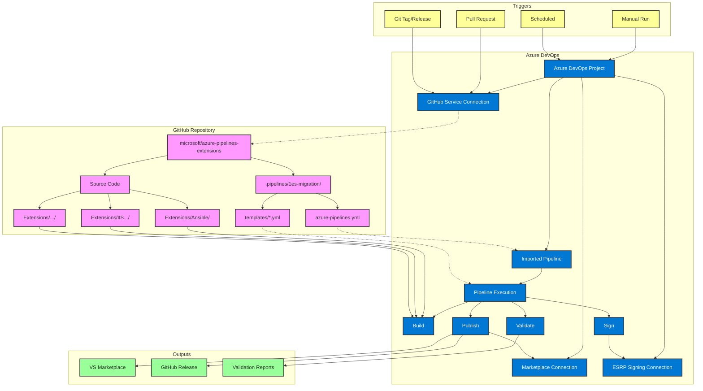

# Connection Architecture

## GitHub ↔️ Azure DevOps Integration Flow



## Key Connection Points

### 1. Service Connections
- **GitHub Connection** (`ADOExtensionAPIGHToken2`): Allows Azure DevOps to read from GitHub
- **Marketplace Connection** (`PublishSignedExtensions`): Publishes to VS Marketplace
- **ESRP Connection**: Signs extensions with Microsoft certificates

### 2. Pipeline Import
```yaml
# Azure DevOps imports and reads:
/.pipelines/1es-migration/azure-pipelines.yml

# Which references templates:
/.pipelines/1es-migration/templates/*.yml

# And builds extensions from:
/Extensions/{ExtensionName}/
```

### 3. Trigger Flow

**Manual Trigger:**
```
Azure DevOps UI → Run Pipeline → GitHub Checkout → Build
```

**PR Trigger:**
```
GitHub PR → Webhook → Azure DevOps → Status Check → GitHub
```

**Release Trigger:**
```
Git Tag Push → GitHub Webhook → Azure DevOps → Parse Tag → Build Specific Extension
```

### 4. Data Flow

```
GitHub Repo          Azure DevOps         External Services
-----------          ------------         -----------------
Source Code    →     Build Agent    →     npm registry
     ↓                    ↓                     ↓
YAML Pipeline  →     1ES Templates  →     ESRP Signing
     ↓                    ↓                     ↓
Extensions     →     Artifacts      →     VS Marketplace
     ↓                    ↓                     ↓
Git Tags       →     Validation     →     GitHub Releases
```

## Toggle-Based Routing

The connection behavior changes based on pipeline parameters:

| Toggle | Connection Impact |
|--------|------------------|
| `isDevBuild: true` | Minimal connections (GitHub only) |
| `isDevBuild: false` | Full connections (GitHub + ESRP + Marketplace) |
| `publishExtension: true` | Activates Marketplace connection |
| `runOnTrigger: true` | Enables GitHub webhook processing |

## Security Layers

1. **GitHub → Azure DevOps**: OAuth or PAT authentication
2. **Azure DevOps → ESRP**: Certificate-based auth via Key Vault
3. **Azure DevOps → Marketplace**: Service connection with RBAC
4. **Webhook Security**: Secret validation for GitHub webhooks

## Performance Optimization

- **Parallel Checkouts**: Multiple extensions built simultaneously
- **Artifact Caching**: Build outputs cached between stages
- **Shallow Clones**: Only required history fetched
- **Matrix Strategy**: Dynamic parallelization based on extension count