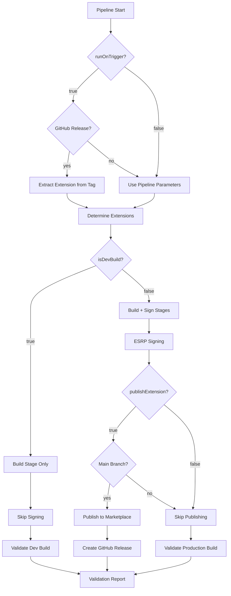

# Toggle System Flow Diagram

## How Pipeline Toggles Control Execution Flow



## Toggle Behaviors

### 1. isDevBuild Toggle

**When `true`:**
- ✓ Build stage executes
- ✗ Sign stage skipped
- ✗ Publish stage skipped
- ✓ Validation confirms dev behavior

**When `false`:**
- ✓ Build stage executes
- ✓ Sign stage executes
- ✓ Publish stage available
- ✓ Full validation suite runs

### 2. publishExtension Toggle

**When `true`:**
- Requires `isDevBuild: false`
- Requires branch = `main`
- ✓ Publishes to marketplace
- ✓ Creates GitHub release
- ✓ Updates version tags

**When `false`:**
- ✓ Build and sign complete
- ✗ No marketplace publication
- ✓ Artifacts available for manual deployment

### 3. runOnTrigger Toggle

**When `true`:**
- Pipeline responds to GitHub webhooks
- Extracts extension name from release tag
- Format: `<extension>-v<version>`
- Example: `Ansible-v2.1.0`

**When `false`:**
- Manual pipeline runs only
- Uses explicit parameter values

### 4. extensionName Options

**"all":**
```yaml
# Discovers and builds all extensions
Extensions/
├── Ansible/
├── IIS Web App Deployment/
└── ... (all found)
```

**Specific name:**
```yaml
# Builds only named extension
extensionName: "Ansible"
→ Builds: Extensions/Ansible/
```

**"custom":**
```yaml
# Uses customExtensionName parameter
extensionName: "custom"
customExtensionName: "MyExtension"
→ Builds: Extensions/MyExtension/
```

## Common Scenarios

### Scenario 1: Daily Development
```yaml
extensionName: "Ansible"
isDevBuild: true          # Fast build, no signing
publishExtension: false   
runOnTrigger: false
```

### Scenario 2: PR Validation
```yaml
extensionName: "all"      # Test all extensions
isDevBuild: false         # Full validation
publishExtension: false   # Don't publish from PR
runOnTrigger: false
```

### Scenario 3: Manual Release
```yaml
extensionName: "IIS Web App Deployment"
isDevBuild: false         
publishExtension: true    # Publish this version
extensionVersion: "2.1.0" # Specific version
runOnTrigger: false
```

### Scenario 4: Automated Release
```yaml
extensionName: "all"
isDevBuild: false
publishExtension: true
extensionVersion: ""      # Auto-increment
runOnTrigger: true        # GitHub trigger enabled
```

## Validation Points by Toggle State

| Toggle State | Validations Run |
|-------------|-----------------|
| `isDevBuild: true` | 1,2,4 (Skip signing, publishing) |
| `isDevBuild: false, publishExtension: false` | 1,2,3,4 (Skip publishing) |
| `isDevBuild: false, publishExtension: true` | 1,2,3,4,5 (All validations) |

## Toggle Priority

1. **Safety First**: `isDevBuild` overrides all other toggles
2. **Branch Protection**: Publishing requires main branch
3. **Explicit Control**: Manual parameters override triggers
4. **Version Control**: Explicit version overrides auto-increment

## Best Practices

1. **Development**: Always use `isDevBuild: true` for local testing
2. **Staging**: Use `isDevBuild: false, publishExtension: false`
3. **Production**: Use `isDevBuild: false, publishExtension: true` only from main
4. **Automation**: Enable `runOnTrigger` only after manual testing

## Debugging Toggles

Check toggle effects in logs:
```
Stage: Initialize
- "Processing extension selection..."
- "Extensions to process: Ansible"

Stage: Build
- "Building extension with gal CLI..."

Stage: SignPackage
- Condition: and(succeeded(), eq(variables['IsDevBuild'], 'false'))
- Skip reason: "IsDevBuild is true"

Stage: Validate
- "✓ Dev build correctly skipped signing"
```