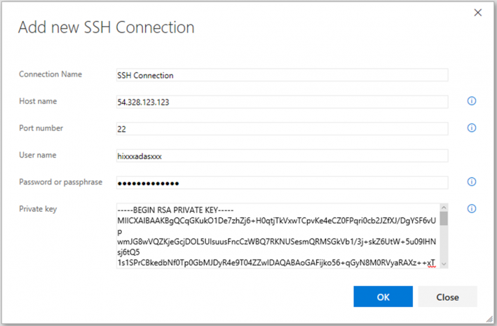
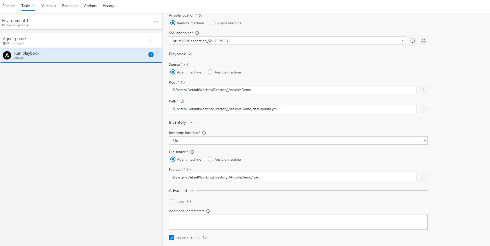
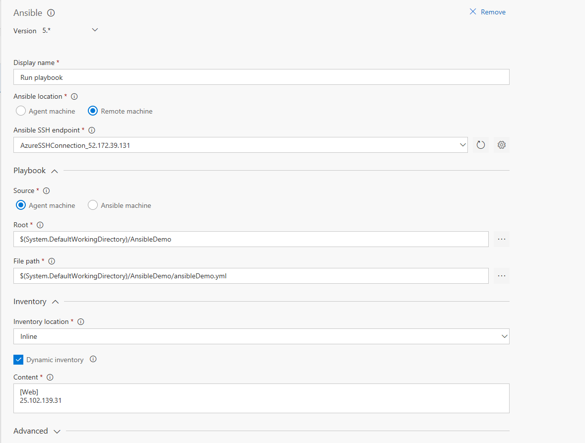

# Ansible extension

This extension includes a build/release task to integrate with [Ansible](http://docs.ansible.com/ansible/latest/index.html). The task executes a given Ansible playbook on a specified list of inventory nodes via command line interface.
Ansible is an open-source IT automation engine that can configure systems, deploy software and orchestrate application deployments.
Ansible uses [Playbooks](http://docs.ansible.com/ansible/latest/playbooks.html) which express configurations, deployment, and orchestration steps in YAML format. Each Playbook maps a group of hosts to a set of roles. Each role is represented by calls to Ansible tasks.
[Inventory](http://docs.ansible.com/ansible/latest/intro_inventory.html) file is a description of the nodes that can be accessed by Ansible.

This task requires that the Playbook and Inventory files be located either on a private Linux agent or on a remote machine where Ansible automation engine has been installed. Additionally Inventory can also be specified inline or as a Host list.

## Prerequisites

### Install Ansible automation engine

Follow the [installation guidance](http://docs.ansible.com/ansible/latest/intro_installation.html) to install Ansible on a private Linux agent or on a remote machine. Currently Ansible can be run from any machine with Python 2.6 or 2.7 installed (Windows isn’t supported for the control machine).

### Create an SSH endpoint

If Ansible is installed on a remote machine, you would need to set up an [SSH endpoint](https://www.visualstudio.com/en-us/docs/build/concepts/library/service-endpoints#sep-ssh) in the administration section of your VSTS project.

- The hostname or IP address of the remote machine, the port number, and the user name are required
- The private key and the passphrase must be specified for authentication.
- A password can be used to authenticate to remote Linux machines, but this is not supported for Mac or OSX systems.
- The public key must be pre-installed or copied to the remote machine.

## Task

Installing the extension adds the following Ansible task which runs a given Playbook:

When Ansible automation engine is located on an Agent machine:

When Ansible automation engine is located on a remote machine:

## Task arguments

* **Ansible location**: Location where Ansible automation engine is installed. Can be either a private agent machine or a remote machine. Ansible communicates with remote machines over SSH and would require the SSH endpoint details.

* **SSH endpoint**\*: Name of the SSH service endpoint containing connection details for the remote machine where Ansible automation engine has been installed.

* **Playbook Source**: Choose agent machine if playbook is part of a linked artifact and should be copied to the remote Ansible machine. Otherwise, select Ansible machine.

* **Playbook root**\*: Specify the working directory path where playbook and associated files are located on the agent machine. All the files in this folder will be copied to Ansible machine.

* **Playbook file path**\*: Specify the path to the playbook file to be executed on the Ansible machine. [Playbooks](http://docs.ansible.com/ansible/latest/playbooks.html) declare Ansible’s configuration, deployment, and orchestration steps in YAML format.

* **Inventory location**: By default, Ansible Inventory is described by a configuration file, in INI format, whose default location is in /etc/ansible/hosts. Inventory can also be specified as a separate configuration file which lists either the IP address or hostname of each node that is accessible by Ansible. Or can be specified as a Host list of comma separated hosts. Example - foo.example.com, bar.example.com.

Alternatively Inventory can be specified inline.

* **Inventory file path**\*: Specify the path to [inventory](http://docs.ansible.com/ansible/latest/intro_inventory.html) host file on Ansible/Agent machine

* **Dynamic Inventory**: Ansible can also use a custom Dynamic Inventory script, which can dynamically pull data from a different system. Check this box if [dynamic inventory](http://docs.ansible.com/ansible/latest/intro_dynamic_inventory.html) is used.

* **Advanced - Sudo**: Run operations with sudo. It works only when the Ansible user is sudoer with nopasswd option.
This also requires desired sudo user name. \"root\" is used when this field is empty.

* **Additional arguments**: The arguments to pass to Ansible command line. Refer to documentation on Ansible [Commands Modules](http://docs.ansible.com/ansible/latest/list_of_commands_modules.html) and [Ad-Hoc Commands](http://docs.ansible.com/ansible/latest/intro_adhoc.html)

* **Advanced - Fail on STDERR**: If this option is selected (the default), the build will fail if the remote commands or script write to STDERR.

* **Control options**: See [Control options](https://www.visualstudio.com/en-us/docs/build/concepts/process/tasks#controloptions)

### Contact Information

For further information or to resolve issues, contact [Developer Community Forum](https://developercommunity.visualstudio.com/spaces/21/index.html).
