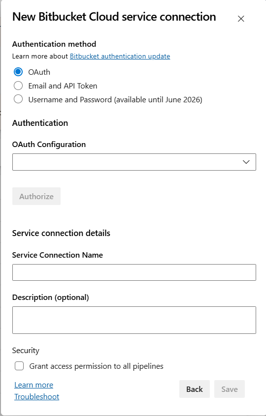
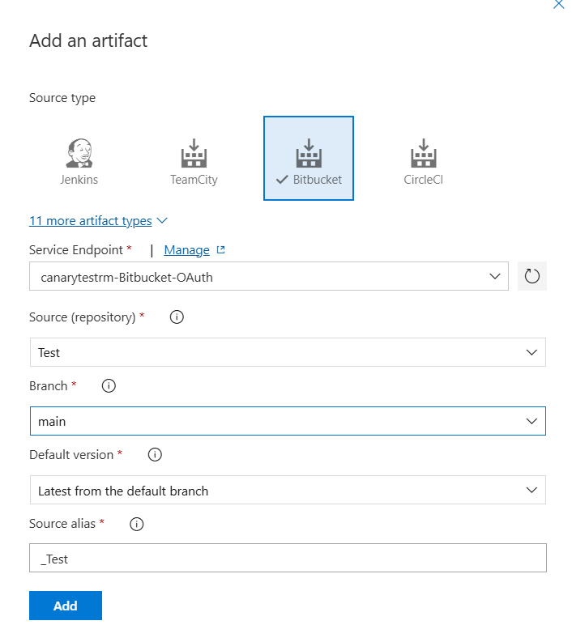

# Bitbucket&reg; artifacts for Release management

This extension integrates Bitbucket&reg; Cloud with Azure Pipelines. It uses the built-in **Bitbucket Cloud** service connection and contributes a **Download Artifacts - Bitbucket** task, so you can consume Bitbucket&reg; repository sources from both **classic release pipelines** and **YAML pipelines** in Azure DevOps.

## Usage
Using the extension is a two-step workflow: (1) create a **Bitbucket Cloud** service connection in your project with OAuth or an email and API token, then (2) reference that connection from a release-pipeline artifact source or from a **`DownloadArtifactsBitbucket`** task in a YAML pipeline.

### Connecting to Bitbucket&reg; Cloud
Go to project settings -> Service connections tab, select **New service connection**, and choose **Bitbucket Cloud**:


### Authentication
For OAuth, select **OAuth**, choose an OAuth configuration, and select **Authorize**. The UI labels the method **OAuth**; Azure DevOps currently supplies the endpoint using the internal `OAuth2` scheme. The task accepts both `OAuth` and `OAuth2` for compatibility.

OAuth access tokens are sent as Bearer tokens when the extension calls the Bitbucket&reg; API. When repositories are cloned, the extension uses `x-token-auth` as the Git username and the OAuth access token as the password.

You can also use **Email and API Token** authentication. Username/password authentication is deprecated and may be disabled by the service or rejected at runtime. For new connections, use OAuth or Email and API Token. The UI label is **OAuth**, while the endpoint may use the internal `OAuth2` scheme; the task accepts both schemes for compatibility.

### Linking Bitbucket&reg; sources
Once you have set up the service endpoint connection, you can link Bitbucket&reg; repository sources in your release definition.


### Using in YAML pipelines
Add the `DownloadArtifactsBitbucket` task to a YAML pipeline to clone a Bitbucket&reg; repository at a selected branch and commit into the agent workspace:

```yaml
steps:
  - task: DownloadArtifactsBitbucket@15
    inputs:
      connection: 'MyBitbucketConnection'        # Service connection name
      definition: 'workspace/repository'         # Bitbucket repository full name
      branch: 'refs/heads/main'                  # Branch to checkout
      version: '1234567890abcdef1234567890abcdef12345678' # Commit id
      downloadPath: '$(Build.SourcesDirectory)/bitbucket'
```

The task requires Azure Pipelines agent version 2.206.1 or newer. Self-hosted agents must also have Git available on `PATH`.

[Learn more about artifacts in Azure Pipelines](https://learn.microsoft.com/en-us/azure/devops/pipelines/release/artifacts). You can use [Azure Pipeline Extensions on GitHub](https://github.com/microsoft/azure-pipelines-extensions/issues) to report issues.

**Note:** Bitbucket&reg; is a trademark owned by Atlassian.
