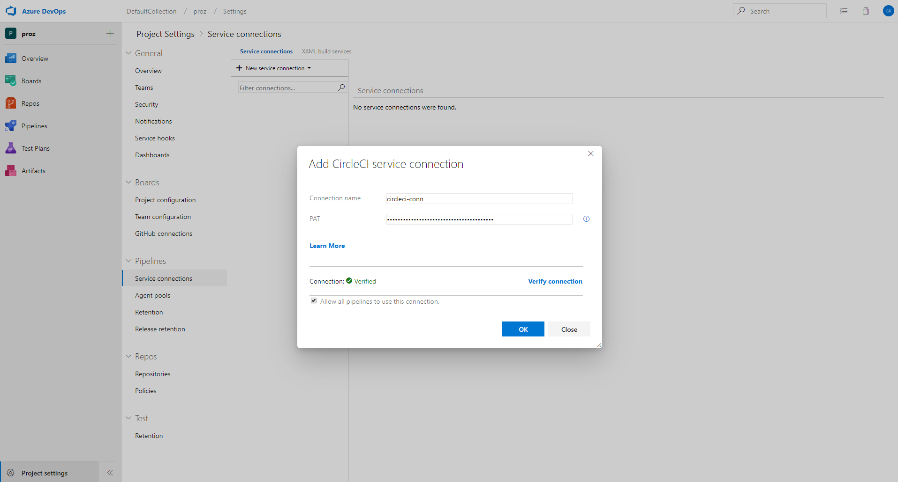
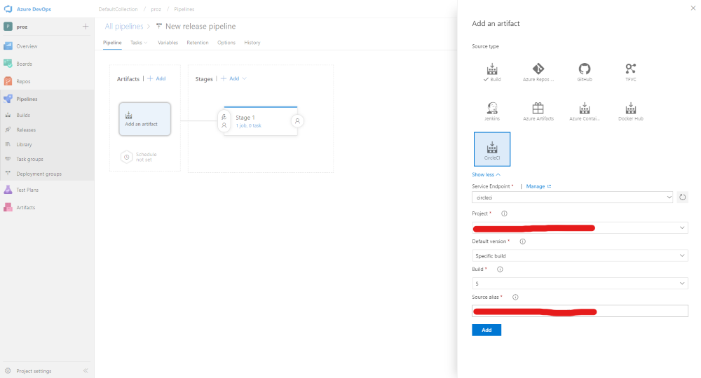

# CircleCI&trade; artifacts for Release pipeline

This extension is an integration point for CircleCI&trade; with Release pipeline in Azure DevOps Services. With this extension, you can deploy artifacts from CircleCI&trade; builds using Release pipeline. 

**Note:** This extension work only with Azure DevOps Services and Azure DevOps Server "18" RC onwards.

## Usage
This extension provides a service endpoint to connect to CircleCI&trade; account. Once connected, you can link a build artifact from the CircleCI&trade; project and deploy the same using Release pipeline orchestration service.

### Connecting to a CircleCI&trade; project
Go to project settings -> *Service connections* tab and create a New Service Connection of type CircleCI&trade;

### Linking a CircleCI&trade; build
Once you have set up the service connection, you would be able to link a CircleCI build artifact in your release pipeline.

[Learn more about artifacts in Release Pipeline](https://msdn.microsoft.com/library/vs/alm/release/author-release-definition/understanding-artifacts). Also you can use [Azure Pipeline Extensions on Github](https://github.com/Microsoft/azure-pipelines-extensions/issues) to report any issues.

**Note:** CircleCI&trade; is trademark owned by **Circle Internet Services, Inc**.

