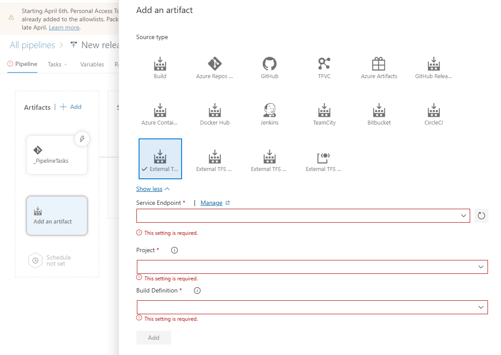

# External TFS Artifacts Extension — Developer Guide

> **New to this extension?** Start here. This document covers everything you need to
> understand before making changes — no prior TFS/Azure DevOps artifact-engine knowledge required.

---

## What Is This Extension?

This Azure DevOps extension lets a pipeline (release or build) **download artifacts from a _different_ Azure DevOps organization or TFS server** than the one running the pipeline. It bridges the gap when your build outputs or source code live in a separate account.

---

## What Problem Does It Solve?

### Without this extension

1. Build outputs live in Org-A (or an on-prem TFS collection)
2. Your release pipeline runs in Org-B
3. You must manually copy artifacts between orgs, or write custom scripts to authenticate and download across the boundary

### With this extension

1. Create a **service connection** pointing to the remote org/TFS
2. Link an **External TFS artifact source** in a release definition, or add one of the **Download Artifacts** tasks in YAML/classic
3. The pipeline authenticates against the remote server → downloads the specified build outputs or Git repo → downstream stages consume them

---

## How Customers Use It

### In YAML Pipelines

```yaml
# Download a build drop from another Azure DevOps org
steps:
  - task: DownloadExternalBuildArtifacts@16
    inputs:
      connectionType: 'reposOrTfs'
      connection: 'MyRemoteTfsConnection'
      project: 'RemoteProject'
      definition: 'CI-Build'
      version: '12345'
      downloadPath: '$(Build.ArtifactStagingDirectory)/external'
```

```yaml
# Clone a Git repo from another Azure DevOps org
steps:
  - task: DownloadArtifactsTfsGit@16
    inputs:
      connectionType: 'reposOrTfs'
      connection: 'MyRemoteTfsConnection'
      project: 'RemoteProject'
      definition: 'my-repo-id'
      branch: 'refs/heads/main'
      version: 'abc1234f'
      downloadPath: '$(Build.ArtifactStagingDirectory)/repo'
```

### In Classic Release Pipelines

1. Add an artifact source → pick **External TFS Build** or **External TFS Git**
2. Select the service connection, project, build definition (or repo), and default version
3. On every release, the backing task downloads artifacts into `$(System.ArtifactsDirectory)/<alias>/`

> **Note:** The remote server must be reachable from the **agent** running the pipeline, not from the Azure DevOps service itself.



---

## Repository Structure

```
Extensions/ExternalTfs/
├── Src/
│   ├── vss-extension.json              ← Extension manifest: contributions, data sources, artifact types
│   ├── readme.md                       ← PUBLIC Marketplace documentation (customer-facing)
│   ├── DEV-GUIDE.md                    ← This file (internal developer doc)
│   ├── mp_terms.md                     ← Marketplace license terms
│   └── Tasks/
│       ├── DownloadExternalBuildArtifacts/
│       │   ├── task.json               ← Task manifest (GUID B099689B-...)
│       │   ├── download.ts             ← Entry point: resolves auth, calls Build API, dispatches to artifact-engine or filesystem copy
│       │   ├── auth.ts                 ← Used when connectionType=ado; exchanges federated token for Azure DevOps access token via MSAL
│       │   ├── vsts.handlebars         ← Maps Container API JSON to artifact-engine items (container artifacts only)
│       │   └── package.json
│       └── DownloadArtifactsTfsGit/
│           ├── task.json               ← Task manifest (GUID bf7b17db-...)
│           ├── downloadTfGit.js        ← Entry point: resolves auth, looks up repo URL via Git API, runs git clone + checkout
│           ├── auth.js                 ← Used when connectionType=ado; WIF token exchange (similar to auth.ts but with differences in error handling)
│           ├── gitwrapper.js           ← Wraps shell git commands (clone/fetch/checkout); injects credentials into clone URLs
│           └── package.json
└── Tests/
    └── Tasks/
        ├── DownloadExternalBuildArtifacts/  ← L0 tests
        └── DownloadArtifactsTfsGit/        ← L0 tests
```

---

## Extension Components

### Tasks and Artifact Source Types

| Task | Version | What it does | Artifact Source Type |
|------|---------|-------------|---------------------|
| `DownloadExternalBuildArtifacts` | @16 | Downloads build artifacts (container or file-share) via artifact-engine | `ExternalTfsBuild` |
| `DownloadArtifactsTfsGit` | @16 | Clones a Git repo via `git clone` | `ExternalTfsGit` |
| _(none — server-side)_ | — | Downloads XAML build drops | `ExternalTfsXamlBuild` |

> Both tasks run on a **build agent** (Node execution handler). They have full access to the agent file system.

**What is ExternalTfsXamlBuild?** This is a legacy artifact type for XAML build definitions on a remote TFS server. Unlike the other two artifact types, it has **no backing task** and no `downloadTaskId` in the manifest — the release server handles the download entirely server-side. The drop location can be either a container (downloaded as zip) or a file share (UNC path). It has its own set of data sources (`XamlProjects`, `XamlDefinitions`, `XamlBuilds`, `LatestXamlBuild`, `XamlBuild`). XAML builds are deprecated, so this artifact type exists only for backward compatibility. See the `externalTFSXamlBuild-release-artifact-type` contribution in `vss-extension.json` for the full definition.

### How Authentication Works

Both tasks have a `connectionType` input that controls which service connection is used:

**Option 1: `connectionType = reposOrTfs`** (default)
The task reads the `connection` input, which accepts an **Azure Repos/Team Foundation Server** service connection. This is the original auth path — authenticates via **PAT** or **Basic Auth** (username + password). The service connection type identifier in `task.json` is `externaltfs` (lowercase in the Build task, `Externaltfs` with capital E in the Git task — both resolve the same endpoint type).

**Option 2: `connectionType = ado`** (preview)
The task reads the `azureDevOpsServiceConnection` input, which accepts an **Azure DevOps** service connection. This path uses **Workload Identity Federation** — the task exchanges a federated token for an Azure DevOps access token via MSAL (see `auth.ts` / `auth.js`). No PAT needed, no expiration to manage.

**Recommendation:** Use `ado` (Workload Identity Federation) for new setups when connecting to Azure DevOps Services. Use `reposOrTfs` when connecting to on-prem TFS or when WIF is not available.

> **Important:** This extension does NOT register the `ExternalTFS` endpoint type — it is a built-in Azure DevOps endpoint. The extension only registers artifact types and tasks that _consume_ it.

---

## Architecture at a Glance

### DownloadExternalBuildArtifacts (`download.ts`)

This task downloads build artifacts (files published by a build) from a remote Azure DevOps org or TFS server:

1. **Resolve credentials** — based on `connectionType`, either reads PAT/password from the service connection (`reposOrTfs`) or exchanges a federated token for an access token via MSAL (`ado` → `auth.ts`).
2. **Query the Build API** — calls `getArtifacts(project, buildId)` to list all artifacts for the specified build. Retries up to 3 times on failure.
3. **Download each artifact** — depending on artifact type:
   - **Container** (server-hosted): Uses artifact-engine's `WebProvider` with `vsts.handlebars` to map the Container API response into downloadable items, then streams them to disk.
   - **File share** (UNC path): Uses artifact-engine's `FilesystemProvider` to copy files directly.

### DownloadArtifactsTfsGit (`downloadTfGit.js`)

This task clones a Git repository from a remote Azure DevOps org or TFS server:

1. **Resolve credentials** — same `connectionType` switch as above (`reposOrTfs` → PAT/password, `ado` → `auth.js` WIF exchange).
2. **Look up the repo** — calls `getRepository()` via the Git API to get the remote clone URL.
3. **Clone the repo** — runs `git clone` via `gitwrapper.js` (which injects credentials into the URL). Retries up to 4 times on failure.
4. **Checkout the version** — if the branch is a PR ref, runs `git fetch` first, then `git checkout <commitId>`.

**Key difference:** The External Build task uses **artifact-engine** (an HTTP download library) while the Git task uses **shell git commands**.


---

## Data Sources

Data sources are referenced in `vss-extension.json` via `dataSourceBindings` for the artifact type contributions:

| Data source | Purpose |
|-------------|---------|
| `Projects` | Populates the Project dropdown |
| `Builds` | Populates the Build/Version dropdown (successful builds) |
| `LatestBuild` | Resolves "Latest" default version |
| `Artifacts` | Lists build artifacts |
| `ArtifactItems` | Browses inside a container artifact |
| `BranchName` | Records branch metadata |
| `Repositories` | Populates the Repository dropdown (Git) |
| `Branches` | Populates the Branch dropdown (Git) |
| `GitCommits` | Populates the Commit/Version dropdown (Git) |
| `GitLatestCommit` | Resolves "Latest from branch" (Git) |
| `GitArtifacts` | Lists Git repo root contents |
| `GitArtifactItems` | Browses Git tree items |
| `XamlProjects` | Populates Projects for XAML builds |
| `XamlDefinitions` | Populates XAML build definitions |
| `XamlBuilds` | Populates XAML build versions |
| `LatestXamlBuild` | Resolves latest XAML build |
| `XamlBuild` | Gets XAML build drop details |

---

## Useful Links

| Resource | Link |
|----------|------|
| GitHub source | <https://github.com/microsoft/azure-pipelines-extensions/tree/master/Extensions/ExternalTfs/Src> |
| Marketplace listing | <https://marketplace.visualstudio.com/items?itemName=ms-vscs-rm.vss-services-externaltfs> |
| Sibling package | [`Extensions/ArtifactEngine`](../../ArtifactEngine) — the download engine (used by External Build task) |
| Task-lib reference | <https://github.com/microsoft/azure-pipelines-task-lib> |
| CI test pipeline | `canarytest/PipelineTasks` — `AzDev-ReleaseManagement-ExternalTFS-CI-Test` |
| PROD release pipeline | `mseng/AzureDevOps` — `AzDev-ReleaseManagement-ExternalTfs` |
