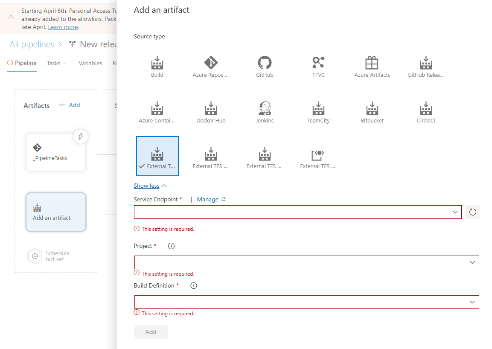
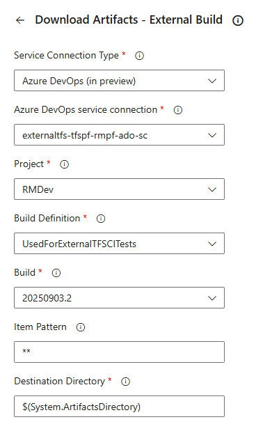
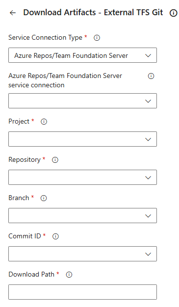
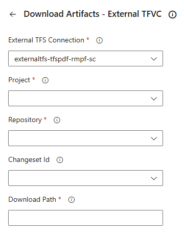
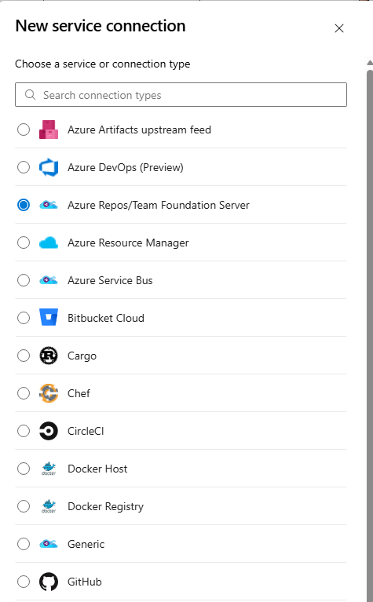
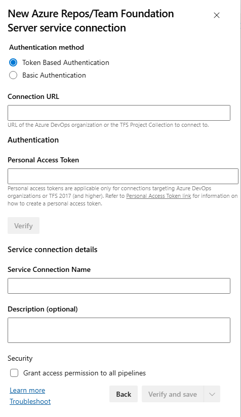

# TFS artifacts for Release Management

## Overview

This extension lets an Azure Pipelines release (or build) pull **build outputs or source code from a _different_ Azure DevOps organization, TFS collection, or on-prem TFS server** than the one running the release.

It solves the "the artifact I want to deploy lives somewhere else" problem.

The extension contributes two things:

1. A **service connection input** that points to an existing **Azure Repos/Team Foundation Server service connection** configured in Azure DevOps and used to authenticate against the remote TFS / Azure DevOps account.
2. **Four artifact source types.** An *artifact source* is the external origin you link to a classic release definition - a Build, Git repo, or TFVC repo on the remote account. Linking one tells Release Management *what to deploy*: the selected version is downloaded automatically at the start of every deployment, and publishing a new external version can trigger a new release. Without this extension a release can only consume artifacts from the same account. The extension is what makes those *external* sources selectable. The same download capability is also packaged as **three download tasks** you can add directly to any build or release pipeline (including YAML).

## Mental model: how a release uses it

```
[ Project Settings ]
        │
        └── Create service connection ─► Azure Repos/Team Foundation Server service connection
                                      ─► or Azure DevOps service connection (task-only)

[ Release Definition ]
        │
        └── Select the previously created service connection
            + artifact type
            + project / build / repo / version
                │
                └── At release start, the matching download task
                    runs on the agent and drops files into
                    $(System.ArtifactsDirectory)
```

Two steps to get going:

1. In **Project Settings**, create a service connection to the remote TFS / Azure DevOps account.
2. In the release definition, **select that existing service connection** and then link one of the External TFS artifact types. If you are using YAML or want an explicit download step, add one of the **Download Artifacts - ...** tasks instead.

## What you get

### Artifact source types (visible in "Link an artifact source")

| Artifact type | What it downloads | Backing task |
|---|---|---|
| External TFS Build | Files published by a build definition (drop) | <ul><li>Directory: <code>Tasks/DownloadExternalBuildArtifacts</code></li><li>UI task name: <strong>Download Artifacts - External Build</strong></li><li>YAML reference: <code>DownloadExternalBuildArtifacts@16</code></li></ul> |
| External TFS XAML Build | Files published by a XAML build definition | _(handled by the release server)_ |
| External TFS Git | A Git repo at a specific branch + commit | <ul><li>Directory: <code>Tasks/DownloadArtifactsTfsGit</code></li><li>UI task name: <strong>Download Artifacts - External TFS Git</strong></li><li>YAML reference: <code>DownloadArtifactsTfsGit@16</code></li></ul> |
| External TFS Version Control | A TFVC repo at a specific changeset | <ul><li>Directory: <code>Tasks/DownloadArtifactsTfsVersionControl</code></li><li>UI task name: <strong>Download Artifacts - External TFVC</strong></li><li>YAML reference: <code>DownloadArtifactsTfsVersionControl@15</code></li></ul> |



### Pipeline tasks (also usable on their own in any build / release)

| Task | Use when you need… | Supported service connections |
|---|---|---|
| **Download Artifacts - External Build** | Build outputs from another TFS / Azure DevOps account or collection | **Azure Repos/Team Foundation Server** service connection or **Azure DevOps** service connection (preview) |
| **Download Artifacts - External TFS Git** | Source code of a Git repo from another TFS / Azure DevOps account | **Azure Repos/Team Foundation Server** service connection or **Azure DevOps** service connection (preview) |
| **Download Artifacts - External TFVC** | Source of a TFVC repo from another TFS account | **Azure Repos/Team Foundation Server** service connection only |

| Download Artifacts - External Build | Download Artifacts - External TFS Git | Download Artifacts - External TFVC |
|---|---|---|
|  |  |  |

## Service connections

### Azure Repos/Team Foundation Server service connection

Created from **Project Settings → Service connections → Azure Repos/Team Foundation Server**.

- **Authentication:** Basic (username + password) or Token / PAT.
- When using Basic auth against on-prem TFS, [Basic Auth must be enabled on the server](https://github.com/Microsoft/tfs-cli/blob/master/docs/configureBasicAuth.md).
- **URL must include the collection name**, e.g. `https://fabfiber.visualstudio.com/DefaultCollection`.
- In task inputs and artifact bindings, this is the connection used by fields labeled **Azure Repos/Team Foundation Server service connection**.

| Choose the connection type | Add the connection |
|---|---|
|  |  |

### Azure DevOps service connection (preview)

Created from **Project Settings → Service connections → Azure DevOps (Preview)**.

A workload-identity based service connection. Supported only by the **External Build** and **External TFS Git** tasks.

## Known issues

**1. Code artifacts (External TFS Version Control and External TFS Git) do not work with PAT-based on-prem Azure Repos/Team Foundation Server service connections.**

External TFVC fails at the download step with:
> TF30063: You are not authorized to access `http://{ExternalTfsServerName}:{port}/tfs/DefaultCollection`.

External TFS Git fails at the download step with:
> Authentication failed for `http://.:********@{ExternalTfsServerName}:{port}/tfs/DefaultCollection/_git/{GitProjectName}/`

Both work fine with PAT-based **Azure DevOps Services** connections.

**2. External TFVC download fails when the agent runs as Network Service.**

Fails with:
> TF30063: You are not authorized to access `http://fabfiber.visualstudio.com/DefaultCollection`

**Workaround:** run the agent as an admin user (interactively or as a service) when using the External TFVC artifact.

## FAQ

**Do I need to provide both an Azure Repos/Team Foundation Server service connection and an Azure DevOps service connection on a task?**
No. Provide one. If both are provided, the Azure DevOps service connection is used.

**I don't see the Azure DevOps service connection type when creating a new connection.**
It is still in private preview and not rolled out publicly.

**Can I use an External TFS build artifact that my Azure DevOps org cannot reach?**
Yes. The Azure DevOps service does not need access; the **agent** running the release does.

**Can I use a build from another collection of my current TFS?**
Yes. Add a service connection that points to the other collection, then link the artifact from it.

**What does the manifest name `externaltfs` mean? Is that a separate customer-visible connection type?**
No. `externaltfs` is the extension's internal endpoint type identifier used in the manifest and task definitions. The customer-visible service connection you create and select is the **Azure Repos/Team Foundation Server** service connection.

**Is XAML build supported?**
Yes — via the *External TFS XAML Build* artifact type.

**Is TFS 2012 supported?**
No. TFS 2013 and later only.

**I get "Missing contribution (ms.vss-releaseartifact.artifact-types)" on TFS 2015 U2 / U3 on-prem.**
Those versions are not supported. The extension requires TFS "15" RC or later.

**Where can I learn more about artifacts in Release Management?**
See the [Release Management artifacts documentation](https://msdn.microsoft.com/library/vs/alm/release/author-release-definition/understanding-artifacts). Report issues at [azure-pipelines-extensions on GitHub](https://github.com/Microsoft/azure-pipelines-extensions/issues).
