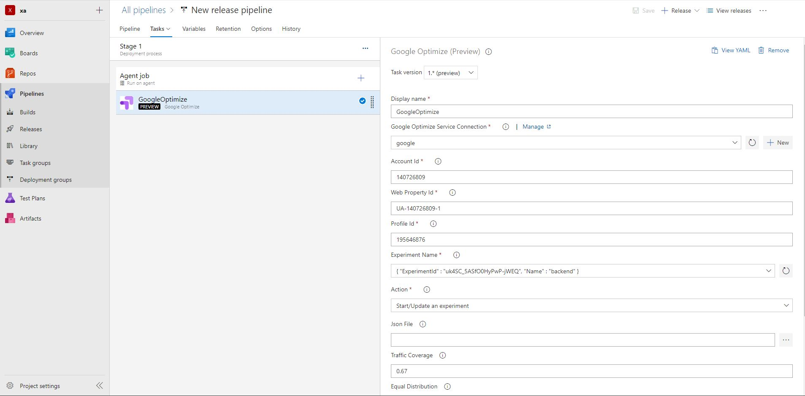
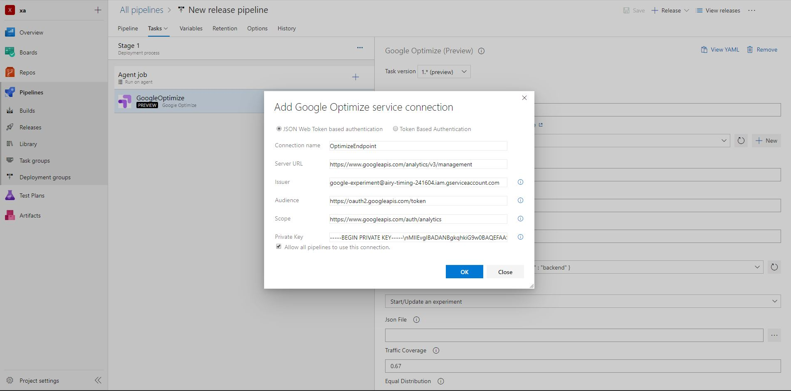

# Google Optimize
Optimize allows you to test variants of web pages and see how they perform against an objective that you specify. Optimize monitors the results of your experiment and tells you which variant is the leader. To get started:
 
 
 
1) [ Set up Optmize](https://support.google.com/optimize/answer/6211921)
2) [ Deploy the optimize snippet on your website](https://support.google.com/optimize/answer/6211921)
3) [ Create your first experiment](https://support.google.com/optimize/answer/6211930)
 
 
 
# Overview
Google Optimize extension for azure devops lets you start , stop and update your experiments in minimal steps. This extension provides you two ways of making changes - 
 
* by entering changes into provided fields in task.
* by adding a json file with proper [schema](Tasks/GoogleOptimize/models/Schema.json)

## Manage experiments with Azure Pipelines 
Start , pause or stop an experiment, assign traffic coverage and set traffic distribution method using the task in Azure Pipelines.

* Search for Google Optimize and click on "Add"

* Now you need to configure the connection to your "Google" account. Click on "+ New" button on the "Google Optimize service connection" field on the right pane
* In the new connection dialog, enter a name for the connection and other four field related to your google account. In order to get all other fields follow the below steps -
    * Visit https://console.developers.google.com/ and register your app as new application with google. 
    * Select the Google Analytics Api for Api selector.
    * Create service account key and obtain json credentials.
    * add the client email from json file to user in google analytics account and provide necessary access.

* Fill account Id , Web Property Id and profile Id.
* Select which experiment to update from the drop down menu
* Select suitable action from action drop down.

NOTE- You can also update the experiments by providing body in a json file. (Experiment Id is a mandotary field )

