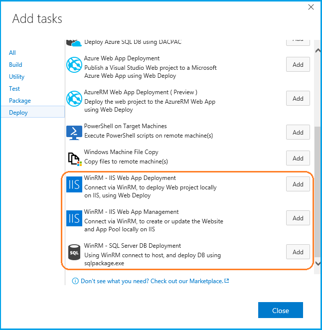
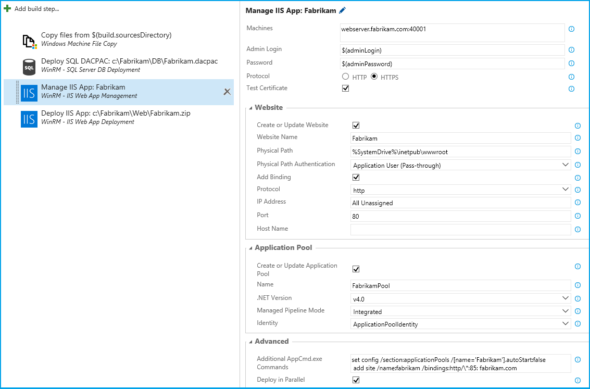
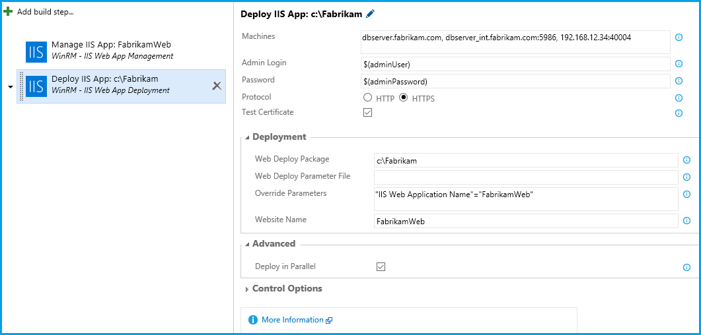
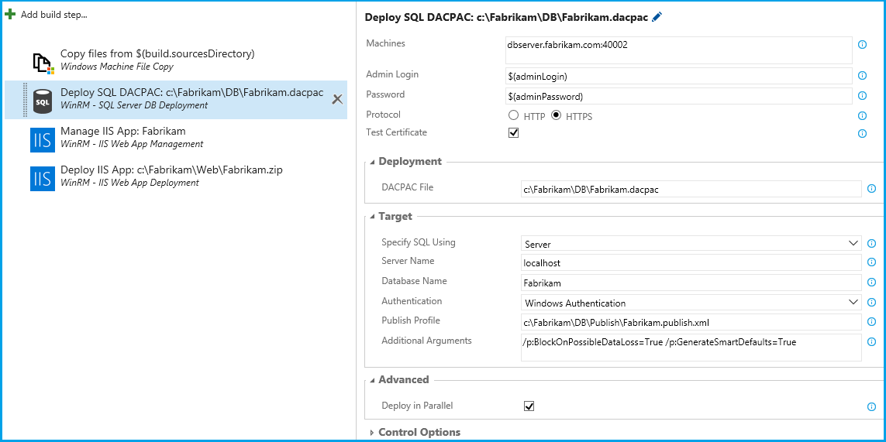

# **IIS Web App Deployment Using WinRM**

Using Windows Remote Management (WinRM), connect to the host machine(s) where IIS or SQL Server is installed, and manage the Web application or deploy the SQL Server Database as described below:

 - Create a new website or update an existing website using [AppCmd.exe](http://www.iis.net/learn/get-started/getting-started-with-iis/getting-started-with-appcmdexe).
 - Create a new application pool or update an existing application pool using [AppCmd.exe](http://www.iis.net/learn/get-started/getting-started-with-iis/getting-started-with-appcmdexe).
 - Deploy a Web Application to the IIS Server using [Web Deploy](http://www.iis.net/downloads/microsoft/web-deploy).
 - Deploy a SQL Server Database using DACPAC and [SqlPackage.exe](https://aka.ms/sqlpackage).

To easily **setup WinRM** on the **host machines**, follow the directions for the **[domain-joined machines](https://www.visualstudio.com/en-us/docs/release/examples/other-servers/net-to-vm)** or the **[workgroup machines](https://www.visualstudio.com/en-us/docs/release/examples/other-servers/net-to-workgroup-vm)**.

The **Azure DevOps** accounts that are using the **preview tasks** wiz. **IIS Web Application Deployment** or **SQL Server Database Deployment**, should move to this extension. All **future enhancements** to the IIS Web App Deployment task or to the SQL Server Database Deployment task will be provided in this extension.

## **Usage**

The extension installs the following tasks:

  

- **WinRM: IIS Web App Management**: Create or update IIS websites and app pools. The task's detailed documentation is in the [source repo](http://aka.ms/IISMgmt).

  

- **WinRM: IIS Web App Deployment**: Deploy an IIS Web App using Web Deploy. The task's detailed documentation is in the [source repo](http://aka.ms/IISWebDeploy).

  

- **WinRM: SQL Server Database Deployment**: Deploy a SQL Server Database using sqlpackage.exe. The task's detailed documentation is in the [source repo](https://aka.ms/SQLDBDeploy).

  

### **Note**

- This extension is **supported in TFS 2017** onwards and is **NOT supported in TFS 2015** or lower versions.
- All the WinRM Tasks can also be used for Azure VMs as with https protocal

### **Contact Information**

For further information or to resolve issues, contact RM_Customer_Queries at Microsoft dot com.

### **Change Log**

For detailed information on changes in new release refer [change log](https://aka.ms/iisextnchangelog)
