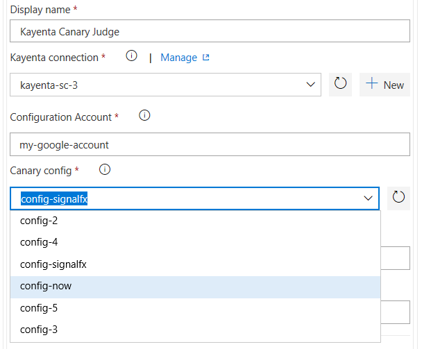

# Kayenta Canary Judge Extension

Kayenta is an automated canary analysis platform which can be used as a standalone service. The Kayenta platform is responsible for assessing the risk of a canary release and checks for significant degradation between the baseline and canary. This is comprised of two primary stages: metric retrieval and judgment.
With Automated Canary Analysis, your organization can reduce the risk of deploying a faulty version over its resources during Continous Deployments with Azure Pipelines. 

This extension enables the integration of Kayenta Canary Judge with Azure Pipelines.                                                 
It includes 
- It’s has an [agentless task](https://github.com/microsoft/azure-pipelines-tasks/blob/master/docs/authoring/servertaskauthoring.md) which initiates a canary analysis in Kayenta and keep polling for the analysis result.
                   

## Usage
#### Integration requires the [Kayenta](https://github.com/spinnaker/kayenta) (Java) application to be built and run on user's instance. Kayenta has a dependency on redis-server.   
   
User must configure Kayenta according for their Metric-source and Storage-account. Kayenta supports Prometheus, SignalFX, Stackdriver, DataDog as its metric source and AzureBlobs, GCS and  AWS_S3 as its persistent storage. 

User must have a canary configuration stored in any of the persistent storages to run the analysis.

#### Create kayenta connection for Azure Pipelines. Provide username and password or token required to access kayenta on your instance.

Inputs provided in the gate are used as configurations for to run the analysis.

 **Inputs for Gate**:
- **Kayenta connection**: Create service connection to your Kayenta server. Provide username and password or access token to establish a connection to Kayenta server.
    - **Canary configuration account**: Provide Storage account name configured in Kayenta to fetch all the canary configurations. 
- **Thresholds**: Gate would pass if the canary-score crosses the pass threshold.
    - **Marginal threshold**: In case of multiple judgements for a canary analysis, if any judgement run has a score below than marginal threshold, then the whole canary analysis fails.
    - **Pass threshold**: The last canary judgement of the analysis must score higher than pass threshold for the analysis to be successful. Otherwise it fails.  
- **Analysis Configuration**: These inputs will drive the execution of canary analysis.
    - **Analysis lifetime duration**: Canary analysis will continue for the given duration.
    - **Analysis interval**: Judgement will occur after each interval during the lifetime of analysis. 
    - **Lookback**: This input will regulate execution of canary analysis on a growing/sliding time window.
- **Query Scopes**: Sets scope to make queries with different labels for your canary and baseline applications to the metric source.
    - **Analysis lifetime duration**: Canary analysis will continue for the given duration.
    - **Analysis interval**: Judgement will occur after each interval during the lifetime of analysis. 
    - **Lookback**: This input will regulate execution of canary analysis on a growing/sliding time window.
    - **Additional query parameters**: Introduces additional query parameters to further set the scope of your query.

- **Example Inputs**:

=====================================================

=====================================================

=====================================================

=====================================================
**Task Success Criteria** :
- **Desired state**: The task would succeed only when the canary scores above than the pass threshold set by the user.

**Task Execution**

Based on the result of canary judge you can either **promote** or **reject** the canary deployment.

