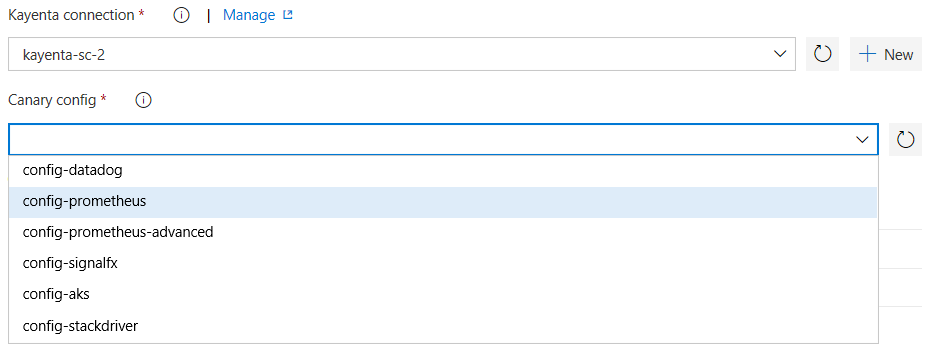

# Kayenta Canary Judge Extension

Kayenta is an automated canary analysis platform which can be used as a standalone service. The Kayenta platform is responsible for assessing the risk of a canary release and checks for significant degradation between the baseline and canary. This is comprised of two primary stages: metric retrieval and judgment.
With Automated Canary Analysis, your organization can reduce the risk of deploying a faulty version over its resources during Continous Deployments with Azure Pipelines. 

This extension enables the integration of Kayenta Canary Judge with Azure Pipelines.                                                 
It includes 
- A [release gate](https://docs.microsoft.com/en-us/azure/devops/pipelines/release/approvals/gates?view=vsts) to hold the pipeline till the canary version crosses the thresholds set by the user for this release. You can set thresholds or edit existing canary configurations for every release.                     

## Usage
#### Integration requires the [Kayenta](https://github.com/spinnaker/kayenta) (Java) application to be built and run on user's instance. Kayenta has a dependency on redis-server.   
   
User must configure Kayenta according to their Metric-Source and Storage-Source. Kayenta supports DataDog, Stackdriver, Prometheus, SignalFX as its metric source and GCS, AWS, Minio as its persistent storage. 

#### Create kayenta connection for Azure Pipelines. Provide username and password or token required to access kayenta on your instance.

#### Configure a release gate for Kayenta Canary Judge.

**Gate** can be configured to **verify new canary release** for every run of the pipeline or can **use an existing request**.
Inputs provided in the gate are used as configuration for invoking the Judge.

 **Inputs for Gate**:
- **Kayenta connection**: Connection to the Kayenta instance.
- **Configuration Account**: Configuration account name for using existing canary configuration.
- **Account Configuration**: Metric-account name and storage-account name for which Kayenta is configured.
- **Thresholds**: Gate would pass if the canary-score crosses the pass threshold.
- **Analysis Configuration**: Lifetime duration of analysis , analysis-interval minutes etc. to configure the execution of canary analysis.
- **Scopes**: Sets the scope for canary analysis.

- **Example Inputs**:

=====================================================

=====================================================

=====================================================

=====================================================

=====================================================
**Gate Success Criteria** :
- **Desired state**: The gate would succeed and the pipeline continues when the canary crosses the threshold set by the user.

**Gate Execution**

