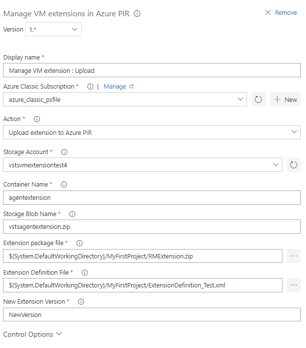
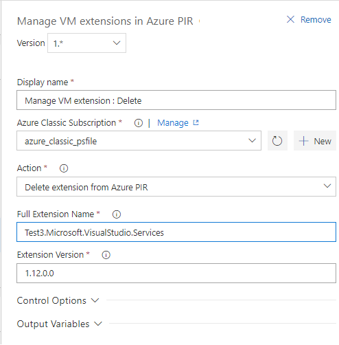

# Manage VM extensions in Azure PIR

This extension allows a user to manage Virtual Machine extensions in Azure Platform Image Repository.
It contains VSTS task which Creates/Updates/Deletes VM extension in Azure PIR based on the action selected by the user.
The task name is 'Manage VM extensions in Azure PIR'. It requires an 'Azure Classic' service endpoint.
Currently, the task just submits the Create/Update/Delete extension requests to Azure PIR. It does not wait for the operation to replicate across geo-locations.

## Create/Update VM extension in Azure PIR

* The task requires as artifacts the extension package and an extension definition file. [Here](https://github.com/Azure/azure-marketplace/wiki/Publishing-and-testing-the-Extension-handler#create-a-definition-file-with-extension-meta-data) is a sample extension definition file.
* If the VM extension does not exist, the task creates the extension.
* It first uploads the extension package to an Azure Classic storage account. If the storage account/container does not exist, the task first created them.

## Delete VM extension from Azure PIR

* For deleting an extension, the task requires the full extension name(&ltPublisher name&gt.&ltExtension name&gt), and the complete extension version to delete(&ltMajor version&gt.&ltMinor version&lt.&ltPatch&gt.&ltRevision&gt).
