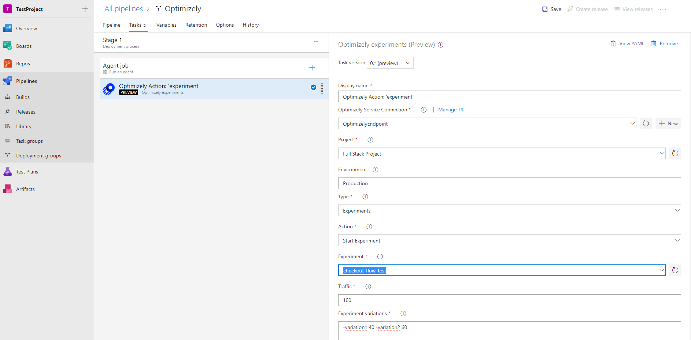
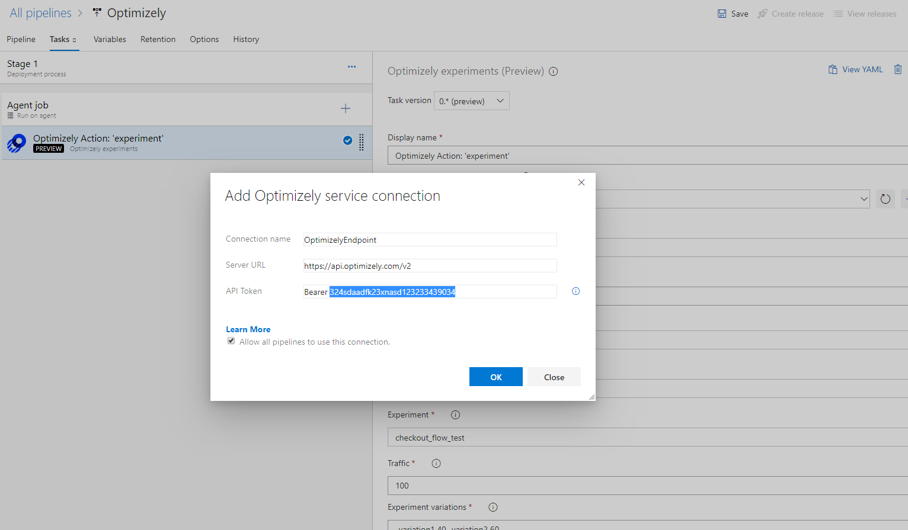
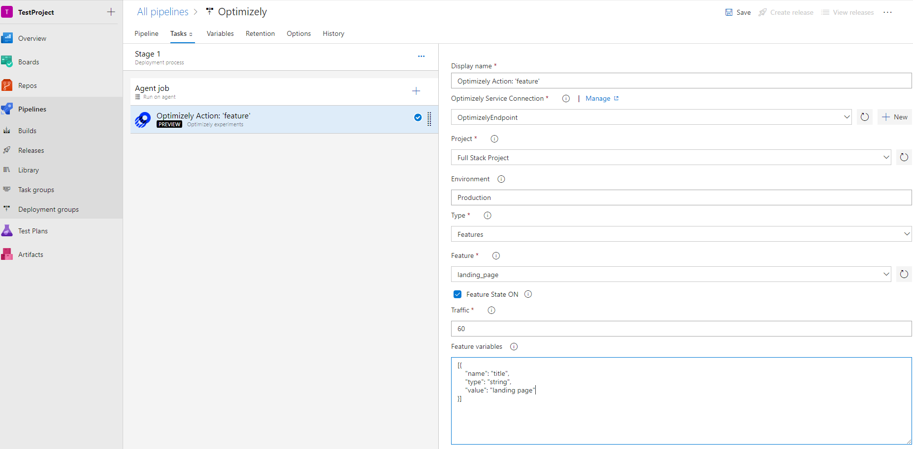

# Optimizely

Optimizely Full Stack is powerful A/B testing and feature flaggging platform for product teams. You can deploy code behind feature flags, experiment with A/B tests, and rollout or rollback features.

## Overview

Optimizely extension for Azure DevOps adds experimentation and feature flag rollout steps to the build and release pipelines, so you can continuously iterate, roll features out, and roll them back using Azure Pipelines. 


### Manage experiments with Azure Pipelines

Start or pause an experiment, assign traffic using the task in Azure Pipelines.

* Search for Optimizely and click on "Add"
* Now you need to configure the connection to your "Optimizely" account. Click on "+ New" button on the "Optimizely - X service connection field on the right pane



* In the new connection dialog, enter a name for the connection and the api token. You can get new api token from the url https://app.optimizely.com/v2/profile/api . Click "Ok"

Note: for the API token: enter the values as "Bearer &lt;your token&gt;"



* You can now select the project, environment, action: start/stop A/B test, and the experiments, Save the release and queue the release using "+ Release"

* Select **Project**, enter **environment** as defined in Optimizely, select the type as **Experiments** and select the experiment to manage from the list.

* **Action:** Select action "Start experiment or Pause experiment"

* **Traffic:** Enter the percentage of total traffic to be assigend for the selected experiment

* **Experiment variations:** Assign percentage traffic to the variations you have defined in Optimizely in the format &lt;variationKeyName&gt; &lt;traffic percentage&gt;. For example, "-treatment 50 -control 50"


### Rollout features with Azure Pipelines

TStart or pause an experiment, assign traffic using the task in Azure Pipelines.

* Search for Optimizely and click on "Add"



* Select **Project**, enter **environment** as defined in Optimizely, select the type as **Features** and select the features to manage from the list.

* Select the checkbox to turn on the feature or vice-versa.

* **Traffic:** Enter the percentage of total traffic to be assigend for the selected experiment

* **Feature variables:** You can set the feature variables you want to optimize. The variables defined here will be added to existing variable set and if a variable with the same name exists it will be overwritten. 

For example,

```json
[ 
{"value": "true",
"type": "boolean",
"name": "showNewHub"
},

{"name": "myVariable",
"type": "string",
"value": "value1"
}]
```
