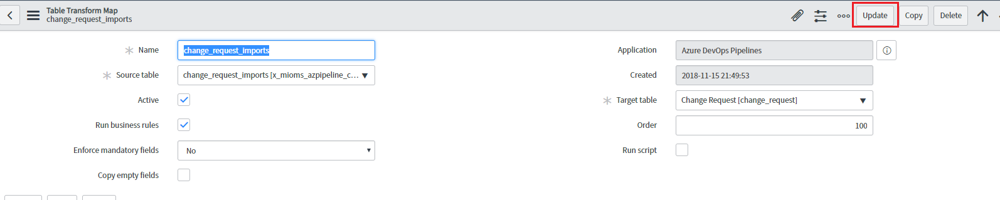
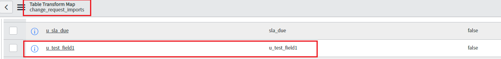

# ServiceNow Change Management Extension

ServiceNow is a software-as-a-service (SaaS) provider of IT service management (ITSM) software, including change management.
Specific change management subprocesses include change risk assessment, change scheduling, change approvals and oversight. 
With change management, your organization can reduce the risks associated with change, while speeding up the deployments with Azure Pipelines. 

This extension enables integration of ServiceNow Change Management with Azure Pipelines.                                                 
It includes a [release gate](https://docs.microsoft.com/en-us/azure/devops/pipelines/release/approvals/gates?view=vsts) to create a change request in ServiceNow and hold the pipeline till the change management process signals the implementation.                     
An agentless task to close (update state of) the change request after the deployment is also provided.

The deployment process in Azure Pipelines helps in automation of the deployment and complement the controls offered by ServiceNow.

## Usage
#### Integration requires the [Azure Pipelines](https://store.servicenow.com/sn_appstore_store.do#!/store/application/fa788cb5dbb5630040669c27db961940) application to be installed on the ServiceNow instance.   
   
   A service account that has been created in ServiceNow and granted the `x_mioms_azpipeline.pipelinesExecution` role would be used for all the communication.

#### Create service connection for ServiceNow in Azure Pipelines. Provide username and password for the service account configured previously.

#### Configure a release gate for ServiceNow Change Management.

A new change request would be created for each run of the pipeline.
Inputs provided in the gate would be set as properties of the change request in ServiceNow.

 **Inputs for Gate**:
- **Short description**: A summary of the change.
- **Description**: A detailed description of the change.
- **Category**:  The category of the change `eg. Hardware, Network, Software`.
- **Priority**: Priority of the change.
- **Risk**: The risk level for the change.
- **Impact**: The effect that the change has on business.
- **Configuration Item**: Configuration item (CI) that the change applies to.
- **Assignment group**:  The group that the change is assigned to.
- **Schedule of change request**: Schedule of the change.                                                                                                                 Date and time should be in UTC and format should be `yyyy-MM-ddTHH:mm:ssZ. eg. 2018-01-31T07:56:59Z.`
- **Additional change request parameters**:  Additional properties of the change request to set.                                                                                      `Name must be field name (not label) prefixed with 'u_' eg. u_backout_plan`.                                                            Value must be a valid, accepted value in ServiceNow. Invalid entries are ignored.

**Gate Success Criteria** :
- **Desired state**: The gate would succeed and the pipeline continues when the change request status is same as the provided value.

**Gate Output Variables** :                                                                                                             
ServiceNow gate produces output variables.                                                                                               You must specify reference name to be able to use these output variables in the deployment workflow. Gate variables can be accessed by using `"PREDEPLOYGATE"` as a `prefix`. For eg. when reference name is set to 'gate1', then the change number can be obtained as `$(PREDEPLOYGATE.gate1.CHANGE_REQUEST_NUMBER)`.

- **CHANGE_REQUEST_NUMBER** : Number of the change request created in ServiceNow.
- **CHANGE_SYSTEM_ID** : SystemId of the change request created in ServiceNow.

#### Add a task to update the status of the change

**Inputs for Update change request task**:

- **Change request number**: Number of the change request that you want to update.
- **Updated status of change request** : Status of the change request that you want to update.
- **Close code and notes**: Closure information for the change request.
- **Additional change request parameters**:  Additional properties of the change request to set.

## Steps to add mapping for custom fields in Import set transform map :

##### In order to insert custom fields for a change request (using additional change request parameters), please add mapping of the custom fields in import set transform map by following below steps:

**Adding custom fields in import set table**:                                      
**Login** to your ServiceNow instance and open link : `https://<Instance-name>.service-now.com/v_ws_editor.do?sysparm_query=name=x_mioms_azpipeline_change_request_import`

1.	Select '**Copy fields from target table**' 
2.	Select **Target table** 'Change Request [**change_request**] from drop down.
3.	Click on '**Update**' 

**Add mapping in Transform map**

1. Navigate to **System Import Sets > Transform Maps**.
2. Open the Transform Map named '**change_request_imports**'

1. In the Field Maps related list, **Click New**.
2. Select the **Source field** (your custom field).
3. Select the **Target field**
4. Click **Submit**

Click **Update**

Field mapping **added**

