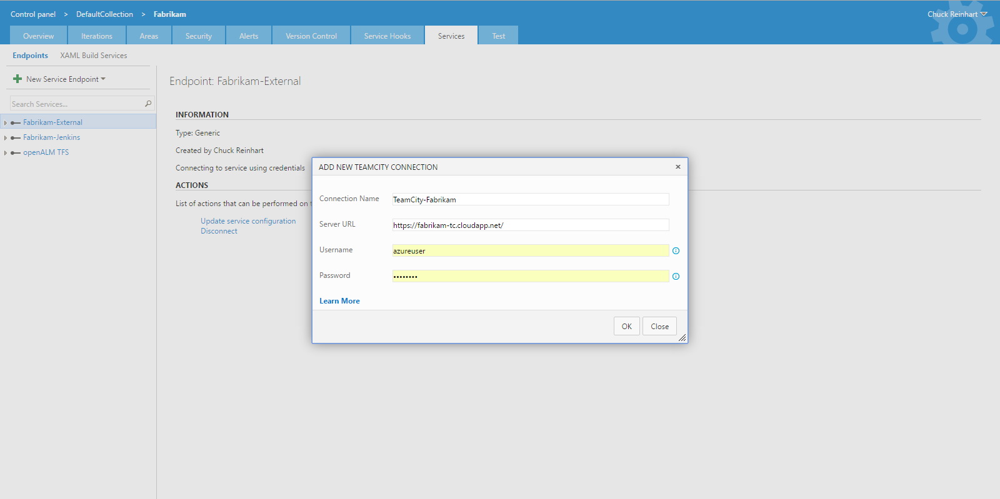

# TeamCity&trade; artifacts for Release management

This extension is an integration point for TeamCity&trade; with Release management in Azure DevOps. With this extension, you can deploy artifacts from TeamCity&trade; builds using Release management. 

**Note:** This extension work only with Azure DevOps and TFS "15" RC onwards.

## Usage
This extension provides a service endpoint to connect to TeamCity&trade; account. Once connected, you can link a build artifact from the TeamCity&trade; project and deploy the same using Release management orchestration service.

### Connecting to a TeamCity&trade; project
Go to project settings -> Services tab and create a New Service Endpoint of type TeamCity&trade;:

### Linking a TeamCity&trade; build
Once you have set up the service endpoint connection, you would be able to link an TeamCity&trade; build artifact in your release definition

[Learn more about artifacts in Release Management](https://msdn.microsoft.com/library/vs/alm/release/author-release-definition/understanding-artifacts). Also you can use [Azure Pipeline Extensions on Github](https://github.com/Microsoft/azure-pipelines-extensions/issues) to report any issues.

**Note:** TeamCity&trade; is trademark owned by Jetbrains s.r.o.

## Contact Information

This extension is authored by [Microsoft DevLabs](https://marketplace.visualstudio.com/publishers/Microsoft%20DevLabs). It is not supported by Microsoft.

To report a problem with this extension, create an issue in this repository. The maintainers of this repository will review and respond to the issue.

You can also report problems or share feedback about this this extension on [Developer Community Forum](https://developercommunity.visualstudio.com/spaces/21/index.html).
