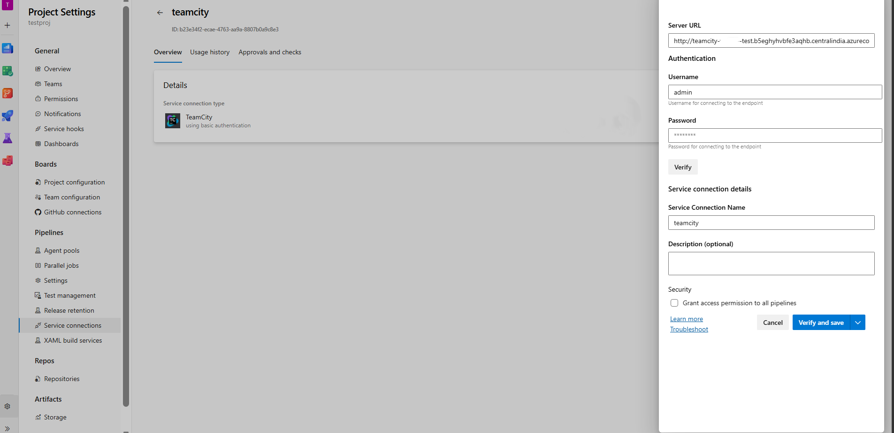
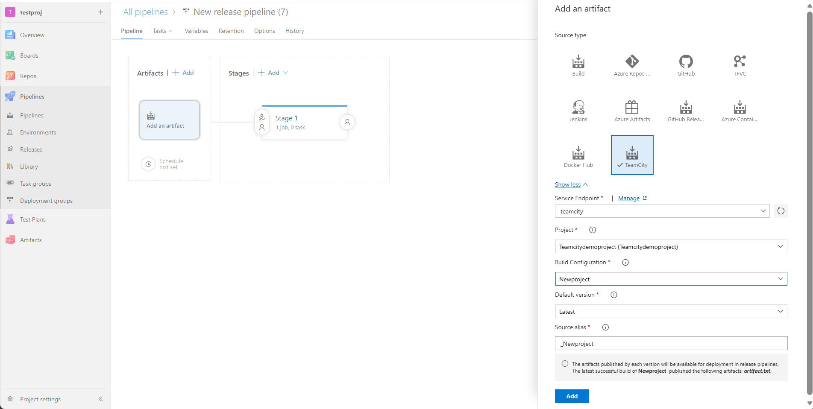

# TeamCity&trade; artifacts for Release management

This extension is an integration point for TeamCity&trade; with Release management in Azure DevOps. With this extension, you can deploy artifacts from TeamCity&trade; builds using Release management. 

> This extension works only with Azure DevOps Services and Azure DevOps Server 2019 Update 1 onwards.

## Usage
This extension provides a service endpoint to connect to TeamCity&trade; account. Once connected, you can link a build artifact from the TeamCity&trade; project and deploy the same using Release management orchestration service.

### Connecting to a TeamCity&trade; project
Go to project settings -> Services tab and create a New Service Endpoint of type TeamCity&trade;:



### Linking a TeamCity&trade; build
Once you have set up the service endpoint connection, you would be able to link an TeamCity&trade; build artifact in your release definition


### Using in YAML pipelines
Add the `DownloadTeamCityArtifacts` task to a YAML pipeline to download build artifacts from TeamCity&trade; directly into the agent workspace:

```yaml
steps:
  - task: DownloadTeamCityArtifacts@15
    inputs:
      connection: 'MyTeamCityConnection'         # Service connection name
      project: 'MyProject'                       # TeamCity project id
      definition: 'MyProject_BuildConfiguration' # TeamCity build type id
      version: '12345'                           # Specific build id
      downloadPath: '$(Build.ArtifactStagingDirectory)/teamcity'
```

[Learn more about artifacts in Azure Pipelines](https://learn.microsoft.com/en-us/azure/devops/pipelines/release/artifacts). Also you can use [Azure Pipeline Extensions on GitHub](https://github.com/microsoft/azure-pipelines-extensions/issues) to report any issues.

**Note:** TeamCity&trade; is trademark owned by Jetbrains s.r.o.

## Contact Information

This extension is authored by [Microsoft DevLabs](https://marketplace.visualstudio.com/publishers/Microsoft%20DevLabs). It is not supported by Microsoft.

To report a problem with this extension, create an issue in this repository. The maintainers of this repository will review and respond to the issue.

You can also report problems or share feedback about this this extension on [Developer Community Forum](https://developercommunity.visualstudio.com/spaces/21/index.html).
