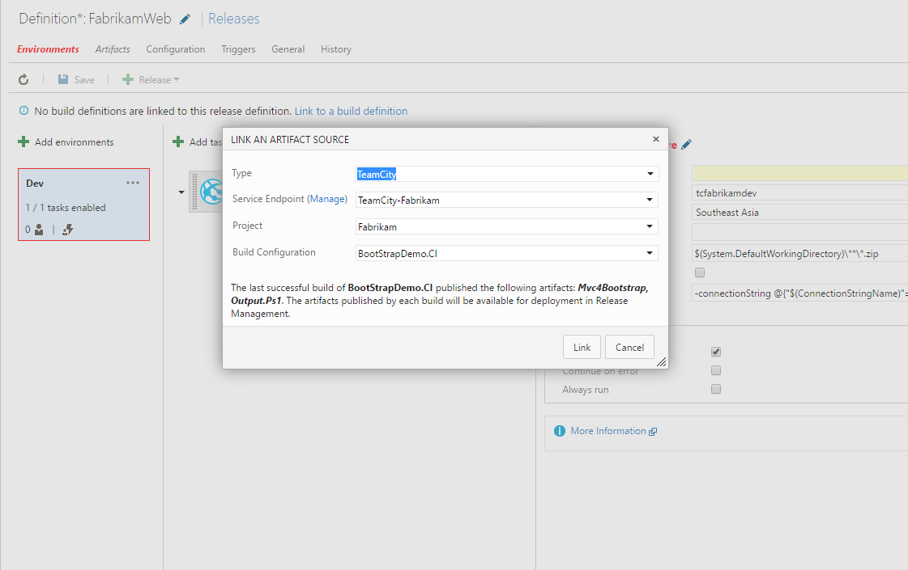

# TeamCity&trade; artifacts for Release management

This extension is an integration point for TeamCity&trade; with Release management in VS Team Services. With this extension, you can deploy artifacts from TeamCity&trade; builds using Release management. 

## Usage
This extension provides a service endpoint to connect to TeamCity&trade; account. Once connected, you can link a build artifact from the TeamCity&trade; project and deploy the same using Release management orchestration service.

### Connecting to a TeamCity&trade; project
Go to project settings -> Services tab and create a New Service Endpoint of type **TeamCity&trade":

### Linking a TeamCity&trade; build
Once you have set up the service endpoint connection, you would be able to link an external TFS/VS-Team-Services build artifact in your release definition

[Learn more about artifacts in Release Management](https://msdn.microsoft.com/library/vs/alm/release/author-release-definition/understanding-artifacts)

**Note: ** TeamCity&trade; is trademark owned by Jetbrains s.r.o.

