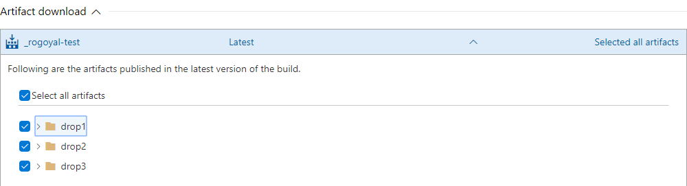
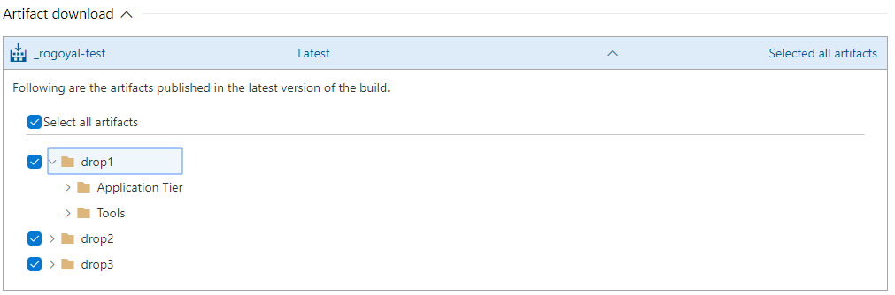

# Supporting Partial Download of Artifacts

Partial download of artifacts is now supported in release pipelines.
This doc describes what the artifact extension author needs to do to get this feature.

1. Provide a data source with the name "artifacts".
2. Provide a data source with the name "artifactItems".

### Role of the above 2 data sources in this feature.

#### artifacts
This data source is expected to return the list of artifacts that the corresponding artifact has published. For instance, in the below picture, the artifact _rogoyal-test has published 3 artifacts i.e drop1, drop2, drop3. These 3 artifacts are listed here are the result of the "artifacts" data source.

Note: All the artifacts in this example are of type "folder" and hence are expand-able. This takes us to the next data source.

#### artifactItems
This data source returns the child items of a given artifact. For example, in the below picture, drop1 artifact item has 2 children items i.e Application Tier and Tools.

Note: Even the 2 children items here are also of type folder, expanding them is not supported. Right now we support only 2 levels of folder hierarchy.

Since we need to know which data source to call for different types of artifact items, you need to specify the "artifactType" field in the "data" dictionary of the "artifacts" data source response. Corresponding to the artifactType, you need to specify the data source binding of the artifact's children in the "browsableArtifactTypeMapping" dictionary. You can take a look at the team city extension [here](https://github.com/Microsoft/azure-pipelines-extensions/blob/a87e4580ac9fa2ded6155b2d8cc334948ba05c12/Extensions/TeamCity/Src/vss-extension.json#L300).
